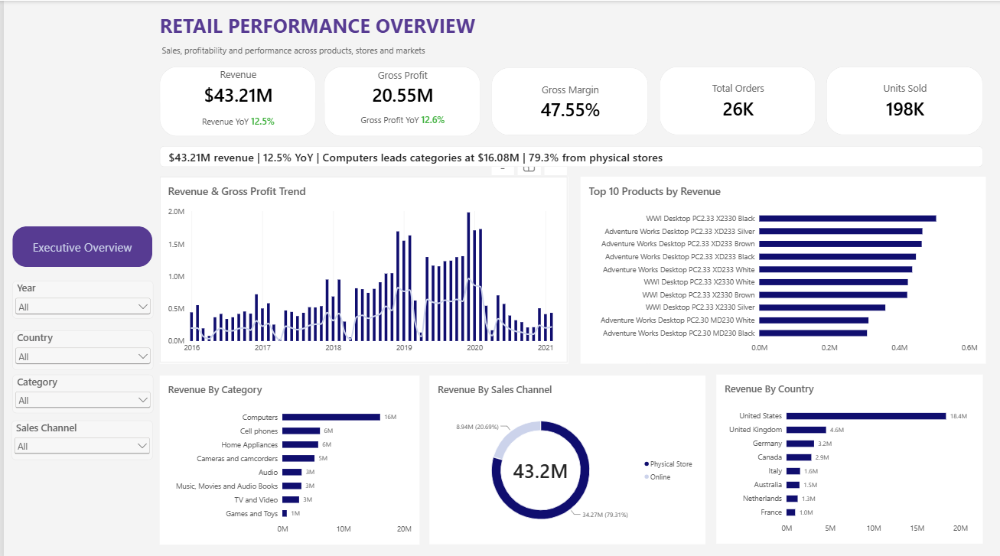

# Retail Sales Store Performance Analysis

An end-to-end retail sales analysis project using SQL and Power BI to evaluate revenue, profitability, product performance, customer behavior, store performance, and sales channels.

## Overview

This project analyzes retail sales data to understand overall business performance and identify patterns across products, categories, customers, stores, countries, currencies, and sales channels.

The project combines SQL-based data exploration and analysis with an interactive Power BI dashboard designed to provide an executive-level view of sales and profitability.

## Business Questions

The analysis focuses on questions such as:

- How much revenue and gross profit does the business generate?
- How is revenue and profitability changing over time?
- Which products and categories generate the most revenue?
- Which countries contribute the most to sales?
- How does performance differ between online and physical stores?
- Which stores generate the most revenue and revenue per square meter?
- How concentrated is revenue among customers?
- How do new and returning customers contribute to sales?
- How do currencies and exchange rates affect the analysis?
- Are there any data quality or relationship issues that could affect the results?

## Data Preparation & Quality Checks

SQL was used to explore the source tables and validate the data before building the dashboard.

The analysis included checks for:

- Duplicate customer, product, store, and exchange-rate keys
- Duplicate sales line items
- Orphaned sales records
- Missing customer, product, store, and exchange-rate relationships
- NULL values
- Invalid quantities
- Invalid delivery dates
- Invalid product prices
- Invalid store sizes
- Invalid exchange rates
- Overall sales and delivery date ranges

The `07_data_quality.sql` script contains the validation queries used for these checks.

## SQL Analysis

The SQL analysis was organized into seven areas:

### 1. Data Exploration
- Table row counts
- Date ranges
- Order and customer counts
- Product and store overviews
- Sales by currency, country, and category

### 2. Sales Analysis
- Revenue
- COGS
- Gross profit
- Gross margin
- Average order value
- Monthly sales performance
- Units per order
- Country and currency performance

### 3. Product Analysis
- Product revenue and profitability
- Top products by revenue
- Top products by gross profit
- Category and subcategory performance
- Brand performance
- Product revenue share
- High-revenue / low-margin products
- Low-volume / high-margin products

### 4. Store Analysis
- Store revenue and profitability
- Country performance
- Revenue per square meter
- Store size vs. revenue
- Online vs. physical store performance
- Store performance by year
- Store age and opening-period analysis

### 5. Customer Analysis
- Customer revenue
- Top customers
- Customer order frequency
- Customer revenue segments
- Average customer revenue
- Customer performance by country and continent
- Repeat customer rate
- Revenue concentration among top customers
- New vs. returning customers

### 6. Currency Analysis
- Exchange-rate coverage
- Sales volume by currency
- Average, minimum, and maximum exchange rates
- Monthly exchange-rate trends
- Daily sales/exchange-rate matching
- Local-currency revenue
- USD revenue
- Currency sales share

### 7. Data Quality
- Duplicate checks
- Relationship validation
- NULL checks
- Invalid-value checks
- Date validation
- Exchange-rate validation

## Power BI Dashboard

The Power BI dashboard provides an interactive executive overview of retail performance.

### Dashboard Features

- Revenue
- Gross profit
- Gross margin
- Total orders
- Units sold
- Revenue YoY
- Gross profit YoY
- Revenue and gross profit trend
- Top 10 products by revenue
- Revenue by category
- Revenue by sales channel
- Revenue by country
- Dynamic key takeaway
- Year, country, category, and sales-channel filters

### Dashboard Preview



## Key Findings

At the overall level, the business generated:

- **$43.21M revenue**
- **$20.55M gross profit**
- **47.55% gross margin**
- **26K orders**
- **198K units sold**
- **12.5% revenue YoY growth**

Additional observations from the dashboard include:

- **Computers** is the leading revenue category, generating approximately **$16.08M**.
- **Physical stores** contribute approximately **79.3% of total revenue**, with online sales accounting for the remaining share.
- The **United States** is the largest revenue-generating country, contributing approximately **$18.4M**.
- Revenue and profitability vary substantially over time, with notable peaks around 2019 and 2020.
- Product performance is concentrated among a relatively small group of high-revenue products.

The interactive dashboard allows these results to be explored further using the available filters.

## Tools Used

- **MySQL** - Data exploration, validation, and analysis
- **SQL** - Aggregation, joins, CTEs, window functions, segmentation, and data-quality checks
- **Power BI** - Data modeling, DAX measures, visualization, and interactive dashboard development
- **GitHub** - Project versioning and portfolio documentation

## Project Structure

```text
retail-sales-store-performance/
│
├── PowerBI/
│   └── retail-sales-performance.pbix
│
├── Screenshots/
│   └── executive-overview.png
│
├── SQL/
│   ├── 01_data_exploration.sql
│   ├── 02_sales_analysis.sql
│   ├── 03_product_analysis.sql
│   ├── 04_store_analysis.sql
│   ├── 05_customer_analysis.sql
│   ├── 06_currency_analysis.sql
│   └── 07_data_quality.sql
│
└── README.md
